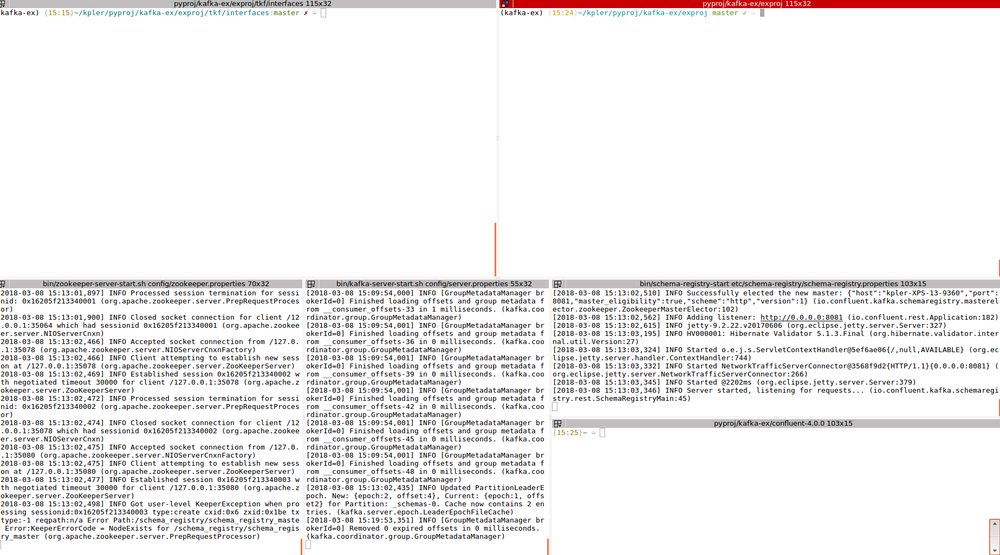

# spark-kafka

This is an example repo featuring code to show different aspects of Stream Processing using [Apache Kafka](https://kafka.apache.org/)
and [Apache Spark](https://spark.apache.org/docs/latest/index.html). It has few interesting features. e.g.

*) It has various different examples of producer and consumer (Plain Text, JSON, Apache Avro)

*) It follows closely [Clean Architecture](https://8thlight.com/blog/uncle-bob/2012/08/13/the-clean-architecture.html)
by Martin Flower, thus making is extremely flexible to be extended and re-used. I can even make a case that one 
can easily use this as a template to create bigger production level applications.

*) It shows some different use cases of Stream Processing.

## Installation

To install this repo - 

1.> Clone this repo

2.> Create a virtualenv and activate it.

3.> Once the virtualenv is activated run `pip install -r requirements.txt` 

4.> And then run `pip install -e .`

The above steps will install required libraries to run this project and also a local spark instance.
As now we can install `pyspark` using `pip`

However to install Kafka and other related confluent softwares the steps are following - 

1.> Ensure you have JAVA installed. (check using - `java -version`. In my case, I had 'openjdk version "1.8.0_151"')

2.> Download the Kafka tgz file from [here](https://www.apache.org/dyn/closer.cgi?path=/kafka/1.0.1/kafka_2.11-1.0.1.tgz)

3.> Unzip it in a directory.

4.> Open two terminals and input the following commands exactly in that order from each of them (you have to be in the Kafka dir that you just unzipped)

    
    bin/zookeeper-server-start.sh config/zookeeper.properties
    bin/kafka-server-start.sh config/server.properties
    
5.> Download the latest confluent platform [here](https://www.confluent.io/download/) (Choose the Open Source version)

6.> Unzip it somewhere

7.> Open a new terminal. Navigate to that dir and then run the following command

    
    bin/schema-registry-start etc/schema-registry/schema-registry.properties
    
After these steps are done you are ready to roll. My usual setup looks like the image following - 

